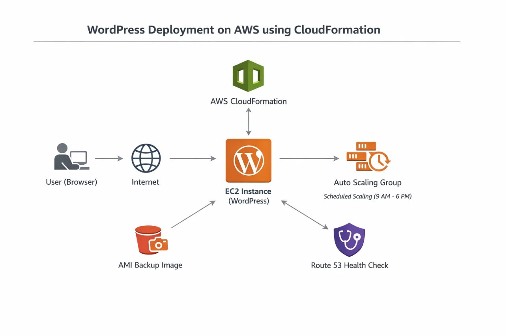
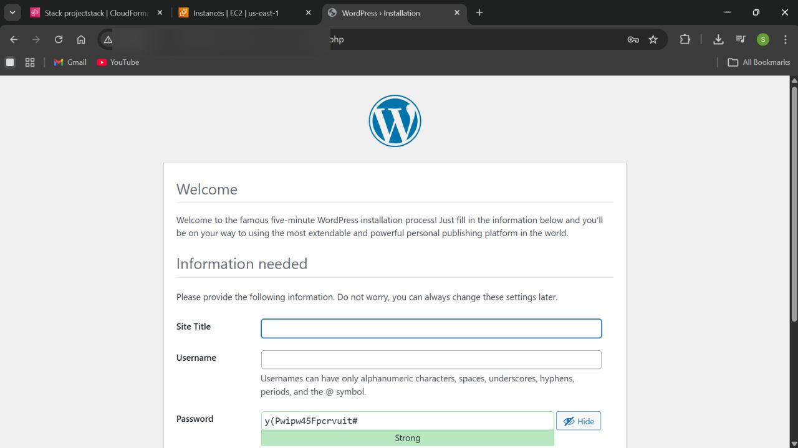
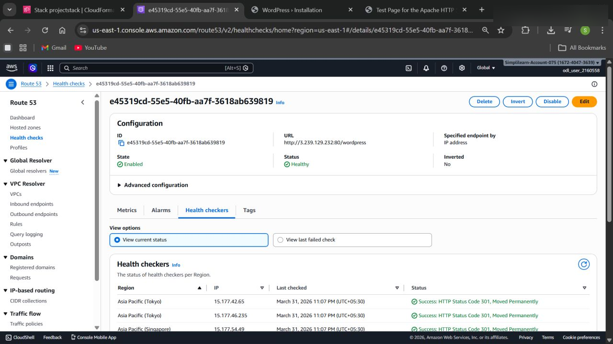
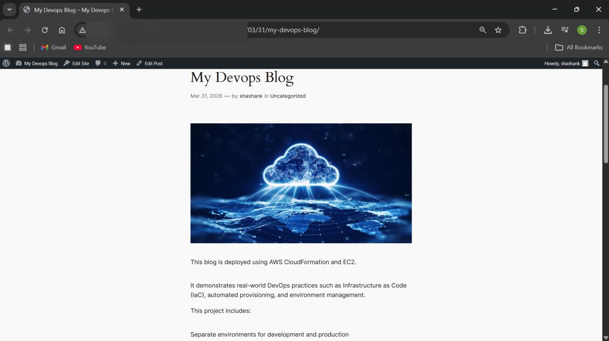

# WordPress Deployment on AWS using CloudFormation

## Overview

This project demonstrates deployment of a production-ready WordPress environment on AWS using Infrastructure as Code (IaC) principles with AWS CloudFormation.

The infrastructure was provisioned using reusable YAML templates and includes automation, scaling, backup, and monitoring concepts commonly used in DevOps environments.

---

## Technologies Used

* AWS EC2
* AWS CloudFormation
* AWS IAM
* AWS Route53
* Auto Scaling Groups
* AMI Backups
* Linux
* WordPress

---

## Features

* Automated infrastructure provisioning using CloudFormation
* WordPress deployment on EC2
* Scheduled Auto Scaling configuration
* Route53 health checks
* AMI backup image creation
* Separate development and production environments
* Infrastructure managed through reusable templates

---

# Architecture Diagram

---

# Deployment Screenshots

## CloudFormation Stack

---

## EC2 Instance

---

## WordPress Installation

---

## Auto Scaling Group

---

## Route53 Health Check

---

## AMI Backup

---

## Live WordPress Site

---

## Key Learnings

* Infrastructure as Code (IaC)
* AWS cloud provisioning
* DevOps automation workflows
* Cloud scalability concepts
* Infrastructure monitoring and reliability
* Troubleshooting deployment and permissions issues

---

## Author

Shashank Jain
